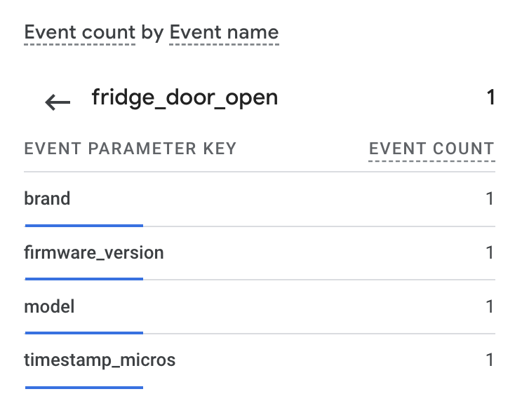
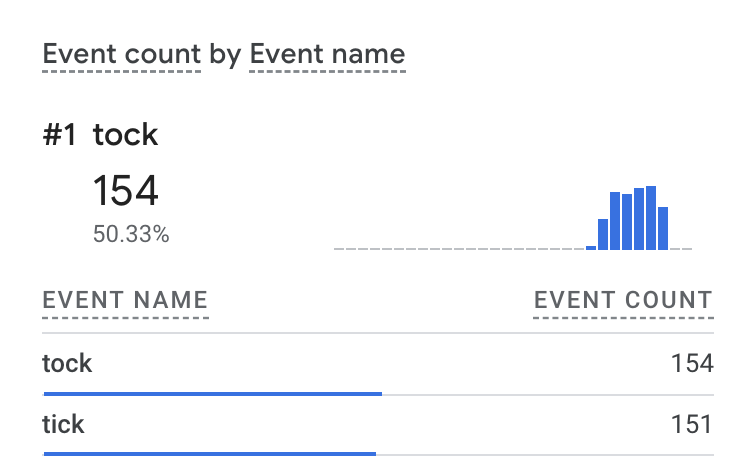

# Google Analytics 4 Measurement Protocol

This repository provides a simple implementation of the Google Analytics 4 Measurement Protocol over Python.
The scripts in this repo send event data to the Google Analytics 4 property (and data stream) of your choice, with event names, user properties, and event parameters.

## Requirements
- Clone the repository to your machine
- Install Python 3.9 or later on your machine
- Setup a virtual environment with: 
    `python -m venv`
    `source ./bin/activate`
- Install the required libraries in requirements.txt with:
    `./bin/python/pip install -r requirements.txt`
- Copy `config_sample.py` to `config.py`

## Setup 
- In Google Analytics 4, visit the admin panel for the GA4 property you want to send traffic to.
- Under Data collection and modification, go to Data Streams,  click the target data stream, and note/copy the value of the Measurement ID (G-XXXXXX). Update the value of `measurement_id` in `config.py` to reflect the data stream ID.
- Further down the page, click Measurement Protocol API secrets, and create a new API secret. Update the `api_secret` key in `config.py`.

## Usage
- Make sure your `config.py` settings are set up.
- In this example we are "emulating" events that could be triggered by a connected refrigerator. Examine `mp_event.py` to adjust.
- Run the `mp_event.py` script with 
`./bin/python/mp_event.py`
- Looking at GA4 realtime reports will show the event being fired, along with event parameters and values
 

Alternatively, running `mp_tick.sh` executes `mp_tick.py` every second and send an event name of either `tick` or `tock` based on whether the timestamp is even or odd.

 

## Additional resources
- [Google Analytics 4 Measurement Protocol Reference]("https://developers.google.com/analytics/devguides/collection/protocol/ga4")
